# База данных и приложение автосервиса, специализирующегося на брендах, не оказывающих поддержку в России"

# Краткое описание идеи проекта

Приложение автосервиса. Автосервис специализируется на брендах, не оказывающих поддержку в России. Приложение также должно предоставлять возможность работы с договорами хранения. 

## Краткое описание предметной области

Автомобилиные сервисы предоставляют услуги ремонта и технического обслуживания автомобилей. В связи с началом в 2022 году СВО, многие иностранные производители ушли с автомобильного рынка, в вязи с чем прекратилась также официальная сервисная поддержка данных производителей. По этой причине, автосерисы, ранее предосталялшие "гранатию произодителя" как УТП, потеряли данную уникальность и встали в один ряд с обычными атосерисами. При этом, согласно мониторингу «Сберстрахования», в 2021 году около 80% автомобилей граждан Российской Федерации приходилось на иномарки, что, с учётом дороговизны товара, говорит о важности решения вопроса поддержки и поставки комплектующих в сегменте брендов данного типа.  

## Краткий анализ аналогичных решений

Ниже учитываются только автомобильные бренды, входящие в список, подлежащий параллельному импорту [Минпромторга](https://www.consultant.ru/document/cons_doc_LAW_454093/a5a47a00bdace2f7821caadb6ac2ebc38ce319cc/#dst100018).

| Автомобильный сервис  | Автомобильные бренды | Личный кабинет клиента | Прайс-лист |
| --------------------- | -------------------- |  :-------------------------:| :--------: |
| [У Сервис+](https://www.uservice.ru/) | Nissan, Suzuki, Infiniti, Subaru, Renault, Chevrolet | - | - |
| [Рольф](https://demo.rolf.ru/) | Acura, Alfa Romeo, Audi, BMW, Chevrolet, Chrysler | + | + |
| [EuroAuto](https://euroauto.ru/service/) | Bently, BMW, Cadilac, Chevrolet, Ford, GMC, Honda, Mercedes-Benz, Mazda, Matsibishi, Porsche, Renault, Rover, Tayota | + | + | 
| [Dynamic Drive](https://dynamic-drive-auto.ru/) | BMW, Mercedes-Benz | - | - |
| [АвтоРитм](https://autoritm-service.ru/) | Ford, Honda, Mazda, Volkswagen, Volvo, Renault | + | - |

Ниже приведено сравнение на основании функционала, предоставляемого в личном кабинете клиента.

| Автомобильный сервис  | Авторизация | Регистрация | Ввод информации о транспорте | Фильтр услуг в звисимости от транспорта | Просмотр прошлых записей в серис | Просмотр договоров хранения | Запись в сервис |
| --------------------- | :---------: | :---------: |  :-------------------------: | :-------------------------------------: | :------------------------------: | :-----------------------------: | :-------------: |
| [Рольф](https://demo.rolf.ru/) | + | + | + | + | + | + | + |
| [EuroAuto](https://euroauto.ru/service/) | + | + | + | + | + | - | + |
| [АвтоРитм](https://autoritm-service.ru/) | + | + | - | - | - | - | + |

## Краткое обоснование целесообразности и актуальности проекта

В рамках приложения есть возможность реализовать весь функционал, указанный в качестве критериев. При этом ни одно из решений на текущий момент не реализаует возможность записи в атосалон на основании предыдущей и не допускает хранения прочих комплектующих, отличных от шин.

## Краткое описание акторов

Гость: посетитель, желающий авторизоваться или зарегистрироваться в качестве клиента;

Клиент: поселитель, желающий записаться в автосалон на определённую услугу;

Администратор: валидирует поступающие записи, составляет расписание механиков. Способен менять информацию по клиентам и механикам, боксам, улугам, договорам.

Механик: выполняет заказы, может оставлять комментарии по ним. Может сам создавать дополнительные записи на услуги для клиентов по результату обслуживания, которые также валидирует администратор.

## Use-Case - диаграмма

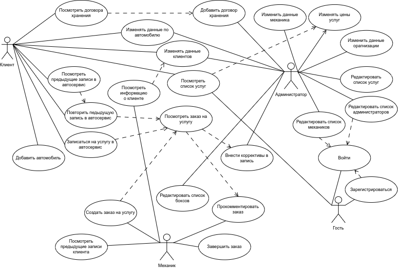

## ER-диаграмма сущностей

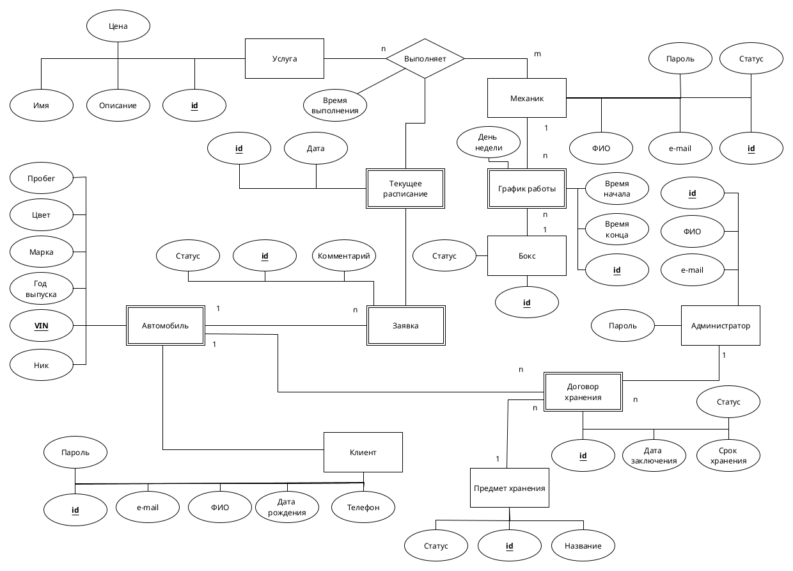

## Диаграмма прехода состояния

ДПС аккаунта механика 

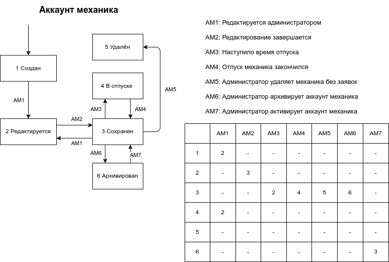

ДПС заявки  

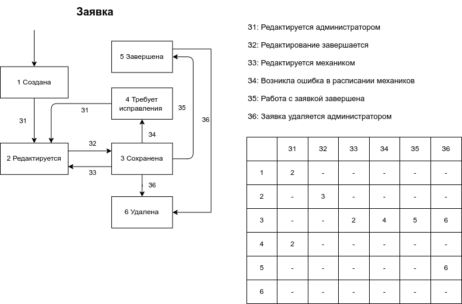

ДПС договора хранения   

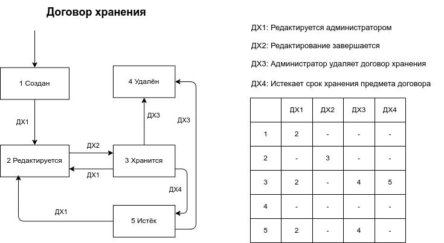

## Пользовательские сценарии 

Сводная таблица по сценариям использования.

| № Процесса  | Процесс | Операция | Клиент | Администратор | Механик | Гость |
| ----------  | ------- | -------- | :----: | :-----------: | :-----: | :---: |
| UC-1.0 | Служебные операции | Создание пользователя | - | Исполнитель | - | Исполнитель |
| UC-1.1 | Служебные операции | Вход | - | - | - | Исполнитель |
| UC-1.2 | Служебные операции | Смена пароля | Исполнитель | Исполнитель | Исполнитель | Исполнитель |
| UC-1.3 | Служебные операции | Просмотр информации по клиенту | Исполнитель | Исполнитель | Исполнитель | - |
| UC-1.4 | Служебные операции | Просмотр информации по механику | - | Исполнитель | Исполнитель | - |
| UC-1.5 | Служебные операции | Просмотр информации по администратору | - | Исполнитель | - | - |
| UC-1.6 | Служебные операции | Просмотр ранее заказанных услуг по клиенту | Исполнитель | Исполнитель | Исполнитель | - |
| UC-1.7 | Служебные операции | Просмотр собственной информации по аккаунту | Исполнитель | Исполнитель | Исполнитель | - |
| UC-1.8 | Служебные операции | Редактирование информации по аккаунту | - | Исполнитель | - | - |
| UC-1.9 | Служебные операции | Просмотр информации по автомобилю клиента | Исполнитель | Исполнитель | Исполнитель | - |
| UC-1.10 | Служебные операции | Редактирование информации по автомобилю | Исполнитель | Исполнитель | - | - |
| UC-1.11 | Служебные операции | Выход | Исполнитель | Исполнитель | Исполнитель | - |
| UC-1.12 | Служебные операции | Просмотр списка предоставляемых услуг | - | Исполнитель | - | - |
| UC-1.13 | Служебные операции | Редактирование списка предоставляемых услуг | Исполнитель | Исполнитель | - | - |
| UC-1.14 | Служебные операции | Редактирование списка услуг механика | - | Исполнитель | - | - |
| UC-1.15 | Служебные операции | Просмотр списка боксов | - | Исполнитель | - | - |
| UC-1.16 | Служебные операции | Редактирование списка боксов | - | Исполнитель | - | - |
| UC-1.17 | Служебные операции | Удаление механика | - | Исполнитель | - | - |
| UC-1.18 | Служебные операции | Удаление администратора | - | Исполнитель | - | - |
| UC-1.19 | Служебные операции | Просмотр списка договоров | Исполнитель | Исполнитель | - | - |
| UC-1.20 | Служебные операции | Редактирование списка договоров | - | Исполнитель | - | - |
| UC-2.0 | Жизненный цикл заявки на услугу | Создание заявки | Исполнитель | - | Исполнитель | - |
| UC-2.1 | Жизненный цикл заявки на услугу | Создание заявки на основе предыдущей | Исполнитель | - | - | - |
| UC-2.2 | Жизненный цикл заявки на услугу | Просмотр заявки | Исполнитель | Исполнитель | Исполнитель | - |
| UC-2.3 | Жизненный цикл заявки на услугу | Редактирование заявки | - | Исполнитель | - | - |
| UC-2.4 | Жизненный цикл заявки на услугу | Завершение выполнения заявки | - | - | Исполнитель | - |
| UC-3.0 | Взаимодействие с графиком работы | Просмотр графика работы механика | - | Исполнитель | Исполнитель | - |
| UC-3.1 | Взаимодействие с графиком работы | Изменение графика работы механика | - | Исполнитель | - | - |
| UC-3.2 | Взаимодействие с графиком работы | Изменение времени записи на услугу | - | Исполнитель | - | - |
| UC-3.3 | Взаимодействи с графиком работы | Пометка механика в отпуск | - | Исполнитель | - | - |

Таблица сложных сценариев

| № Процесса | Процесс | Операция |
| ---------- | ------- | -------- |
| UC-1.1 | Служебные операции | Вход | 
| UC-1.8 | Служебные операции | Редактирование информации по аккаунту |
| UC-2.0 - UC-2.4 | Жизненный цикл заявки на услугу | |
| UC-3.1 - UC-3.3 | Взаимодействие с графиком работы | |

|Индентификатор и название варианта использования| UC-1.0 Создание пользователя |
| ---------------------- | --------------------- |
| Пользователь | Администратор, Гость |
| Условие начала процесса | Пользователь хочет создать новый аккаунт. |
| Предварительные условия и зависисмости | - |
| Выходные параметры (результат) | POST-1. в системе появился новый аккаут. |
| Нормальное направление процесса | **1.0 Администратор создёт новый аккаут в системе** <ol><li>пользователь осуществляет вход (выполняется процесс UC-1.1);</li><li>пользователь нажимает на вкладку "Аккаунты" в навигационном меню;</li> <li>пользователь нажимает на вкладку "Клиенты", "Механики" или "Администраторы";</li> <li>пользователь нажимает кнопку "Создать"; </li> <li> пользователь вводит информацию о новом аккаунте; </li><li>пользователь нажимает кнопку "Создать".</li></ol> **2.0 Гость хочет зарегистрироваться** <ol><li>пользователь нажимает кнопку "Войти";</li><li>пользователь нажимает кнопку "Зарегистрироваться";</li><li>пользователь вводит данные по новому клиенту;</li><li>пользователь нажимает кнопку "Создать".</li></ol>|
| Альтернативное направление процесса | - |
| Исключение | **1.0 2.0 E1 Пользователь с таким e-mail существует** |

|Индентификатор и название варианта использования| UC-1.1 Вход |
| ---------------------- | --------------------- |
| Пользователь | Гость |
| Условие начала процесса | Пользователь хочет авторизоваться в системе. |
| Предварительные условия и зависисмости | PRE-1. пользователь с таким e-mail существует (выполнен процесс UC-1.0).|
| Выходные параметры (результат) | POST-1. пользователь авторизоан. |
| Нормальное направление процесса | **1.0 Пользователь авторизовывается в системе** <ol> <li>пользователь нажимает на вкладку "Вход" в навигационном меню;</li> <li>пользователь вводит e-mail и пароль;</li> <li>пользователь нажимает кнопку "Войти".</li></ol>|
| Альтернативное направление процесса | - |
| Исключение | **1.0 E1 Пользователя с таким e-mail нет в системе**   **1.1 E2 Пароль пользователя некорректен** |

|Индентификатор и название варианта использования| UC-1.2 Смена пароля |
| ---------------------- | --------------------- |
| Пользователь | Клиент, Администратор, Механик, Гость |
| Условие начала процесса | Пользователь хочет сменить пароль. |
| Предварительные условия и зависисмости | - | 
| Выходные параметры (результат) | POST-1. у пользователя изменился пароль. |
| Нормальное направление процесса | **1.0 Пользователь меняет пароль через страницу с информацией о пользователе (кроме гостя)** <ol> <li>пользователь осуществляет вход (выполняется процесс UC-1.1);</li> <li>выполянется процесс UC-1.7;</li> <li> пользователь нажимает на кнопку "Сменить пароль"; </li><li>пользователь вводит новый пароль (дважды);</li> <li>пользователь нажимает на кнопку "Сменить".</li></ol> **2.0 Пользователь забыл пароль** <ol><li>пользователь нажимает на вкладку "Вход" в навигационном меню;</li><li>пользователь нажимает на кнопку "Сменить пароль";</li><li>пользователь нажимает на ссылку, которая пришла ему на почту;</li><li>пользователь вводит новый пароль (дважды);</li><li>пользователь нажимает на кнопку "Сменить".</li></ol>|
| Альтернативное направление процесса | **1.1 Администратор меняет пароль пользователя** <ol><li>Администратор осуществляет вход (выполняется процесс UC-1.1);</li><li>пользователь нажимает на вкладку "Аккаунты";</li><li>Находит аккаунт, для которого желает сменить пароль (выполняются процессы UC-1.3, UC-1.4 или UC-1.5);</li><li>пользователь нажимает на кнопку "Сменить пароль";</li><li>пользователь вводит новый пароль (дважды);</li><li>пользователь нажимает кнопку "Сменить".</li></ol>|
| Исключение | **1.0 1.1 2.0 E1 Один из вводов пароля отличается от другого**   **1.1. E2 Пользователя с введёнными параметрами не существует**|

|Индентификатор и название варианта использования| UC-1.3 Просмотр информации по клиенту |
| ---------------------- | --------------------- |
| Пользователь | Администратор, Механик |
| Условие начала процесса | Пользователь хочет посмотреть страницу определённого клиента. |
| Предварительные условия и зависисмости | PRE-1. пользователь осуществил вход (выполнен процесс UC-1.1).  | 
| Выходные параметры (результат) | POST-1. открыта информационная страница опеделённого клиента. |
| Нормальное направление процесса | **1.0 Пользователь просматривает страницу при просмотре заявки на услугу** <ol> <li>пользователь нажимает на ФИО клиента.</li></ol> |
| Альтернативное направление процесса | **1.1 Администратор заходит на страницу через список клиентов** <ol></li><li>пользователь нажимает на вкладку "Аккаунты";</li><li>пользователь нажимает на вкладку "Клиенты";</li><li>пользователь осуществляет поиск требуемого пользователя;</li><li>пользователь нажимает на строчку с требуемым пользователем.</li></ol>|
| Исключение | **1.0 1.1 E1 Пользователя с введёнными параметрами не существует**|

|Индентификатор и название варианта использования| UC-1.4 Просмотр информации по механику |
| ---------------------- | --------------------- |
| Пользователь | Администратор |
| Условие начала процесса | Пользователь хочет посмотреть страницу определённого механика. |
| Предварительные условия и зависисмости | PRE-1. пользователь осуществил вход (выполнен процесс UC-1.1).  | 
| Выходные параметры (результат) | POST-1. открыта информационная страница опеделённого механика. |
| Нормальное направление процесса | **1.0 Пользователь просматривает страницу при просмотре заявки на услугу или расписания, если пользователь администратор** <ol> <li>пользователь нажимает на ФИО механика.</li></ol> |
| Альтернативное направление процесса | **1.1 Администратор заходит на страницу через список механиков** <ol></li><li>пользователь нажимает на вкладку "Аккаунты";</li><li>пользователь нажимает на вкладку "Механики";</li><li>пользователь осуществляет поиск требуемого пользователя;</li><li>пользователь нажимает на строчку с требуемым пользователем.</li></ol>|
| Исключение | **1.0 1.1 E1 Пользователя с введёнными параметрами не существует**|

|Индентификатор и название варианта использования| UC-1.5 Просмотр информации по администратору |
| ---------------------- | --------------------- |
| Пользователь | Администратор |
| Условие начала процесса | Пользователь хочет посмотреть страницу определённого администратора. |
| Предварительные условия и зависисмости | PRE-1. Пользователь осуществил вход (выполнен процесс UC-1.1).  | 
| Выходные параметры (результат) | POST-1. Открыта информационная страница опеделённого администратора. |
| Нормальное направление процесса | **1.0 Пользователь просматривает страницу при просмотре заявки на услугу** <ol> <li>пользователь нажимает на ФИО администратора.</li></ol> |
| Альтернативное направление процесса | **1.1 Администратор заходит на страницу через список администраторов** <ol></li><li>пользователь нажимает на вкладку "Аккаунты";</li><li>пользователь нажимает на вкладку "Администраторы";</li><li>пользователь осуществляет поиск требуемого пользователя;</li><li>пользователь нажимает на строчку с требуемым пользователем.</li></ol>|
| Исключение | **1.0 1.1 E1 Пользователя с введёнными параметрами не существует**|

|Индентификатор и название варианта использования| UC-1.6 Просмотр ранее заказанных услуг по клиенту |
| ---------------------- | --------------------- |
| Пользователь | Клиент, Администратор, Механик |
| Условие начала процесса | Пользователь хочет посмотреть список ранее заказанных услуг по клиенту. |
| Предварительные условия и зависисмости | PRE-1. пользователь осуществил вход (выполнен процесс UC-1.1). | 
| Выходные параметры (результат) | POST-1. у пользователя отображается список ранее заказанных услуг. |
| Нормальное направление процесса | **1.0 Пользователь является клиентом** <ol> <li>пользователь нажимает на кнопку "Заказы" в навигационном меню.</li> </ol> **2.0 Пользователь является механиком или администратором** <li>пользователь открывает страницу клиента (выполняется процесс UC-1.3);</li> <li>пользователь нажимает кнопку "Заказы". </li></ol> 
| Альтернативное направление процесса | - |
| Исключение | - |

|Индентификатор и название варианта использования| UC-1.7 Просмотр собственной информации по аккаунту |
| ---------------------- | --------------------- |
| Пользователь | Клиент, Администратор, Механик |
| Условие начала процесса | Пользователь хочет увидеть собственную информацию по аккаунту. |
| Предварительные условия и зависисмости | PRE-1. пользователь осуществил вход (выполнен процесс UC-1.1). | 
| Выходные параметры (результат) | POST-1. у пользователя отображается информация по аккаунту. |
| Нормальное направление процесса | **1.0 Пользователь просматривает собственную информацию об аккаунте** <ol> <li>пользователь нажимает на иконку пользователя;</li><li>пользователь нажимает на кнопку "Об аккаунте".</li></ol> 
| Альтернативное направление процесса | - |
| Исключение | - |

|Индентификатор и название варианта использования| UC-1.8 Редактирование информации по аккаунту |
| ---------------------- | --------------------- |
| Пользователь | Администратор, Клиент |
| Условие начала процесса | Пользователь хочет увидеть собственную информацию по аккаунту. |
| Предварительные условия и зависисмости | PRE-1. пользователь осуществил вход (выполнен процесс UC-1.1).   PRE-2. пользователь или открыл сбственную страницу аккаунту, или клиента, или механика, или другого администратора (выполнены процессы UC-1.7, UC-1.5, UC-1.4 или UC-1.3). | 
| Выходные параметры (результат) | POST-1. у пользователя отображается информация по аккаунту. |
| Нормальное направление процесса | **1.0 Пользователь редактирует информацию об аккаунте** <ol> <li>пользователь нажимает кнопку "Редактировать";</li><li>пользователь редактирует информацию, как ему требуется;</li><li>пользователь нажимает кнопку "Сохранить".</li></ol> 
| Альтернативное направление процесса | - |
| Исключение | **1.0 E1 Новый e-mail уже существует в системе**   **1.0 E2 Другой администратор уже редактирует аккаут** |

|Индентификатор и название варианта использования| UC-1.9 Просмотр информации по автомобилю клиента |
| ---------------------- | --------------------- |
| Пользователь | Администратор, Механик, Клиент |
| Условие начала процесса | Пользователь хочет увидеть информацию по конкретному автомобилю клиента. |
| Предварительные условия и зависисмости | PRE-1. пользователь осуществил вход (выполнен процесс UC-1.1). | 
| Выходные параметры (результат) | POST-1. у пользователя отображается информация по автомобилю. |
| Нормальное направление процесса | **1.0 Клиент просматривает свои автомобили** <ol> <li>пользователь нажимает кнопку "Автомобили".</li></ol> **2.0 Механик или администратор просматривает информацию клиента** <ol><li>пользователь заходит на страницу клинета (выполняется процесс UC-1.3);</li><li>пользователь нажимает на кнопку "Автомобили".</li></ol> **Администратор или механик осуществляют поиск автомобиля** <ol><li>пользователь нажимает на вкладку "Транспорт" в навигационном меню;</li><li>Пользователь вводит VIN, клиента, почту или пользовательский ник автомобиля;</li><li>Пользователь нажимает на строчку с нужным автомобилем.</li></ol> 
| Альтернативное направление процесса | - |
| Исключение | **3.0 По введённым параметром машины не обнаружено** |

|Индентификатор и название варианта использования| UC-1.10 Редактирование информации по автомобилю |
| ---------------------- | --------------------- |
| Пользователь | Администратор, Клиент |
| Условие начала процесса | Пользователь хочет редактировать информацию автомобиля. |
| Предварительные условия и зависисмости | PRE-1. пользователь открыл страницу с информацией по автомобилю (выполнен процесс UC-1.9). | 
| Выходные параметры (результат) | POST-1. пользователь отредактировал информацию по автомобилю. |
| Нормальное направление процесса | **1.0 Пользователь редактирует информацию по автомобилю** <ol> <li>пользователь нажимает кнопку "Редактировать";</li><li>пользователь вводит новую информацию по автомобилю;</li><li>пользователь нажимает кнопку "Сохранить".</li></ol>  
| Альтернативное направление процесса | - |
| Исключение | **1.0 E1 другой администратор редактирует информацию о автомобиле** |

|Индентификатор и название варианта использования| UC-1.11 Выход |
| ---------------------- | --------------------- |
| Пользователь | Администратор, Механик, Клиент |
| Условие начала процесса | Пользователь осуществляет выход из системы. |
| Предварительные условия и зависисмости | PRE-1. пользователь осуществил вход (выполнен процесс UC-1.1). | 
| Выходные параметры (результат) | POST-1. пользователь вышел из системы. |
| Нормальное направление процесса | **1.0 Пользователь осуществляет выход из системы** <ol><li>пользователь нажимает на иконку пользователя;</li><li>пользователь нажимает кнопку "Выйти".</li></ol>  
| Альтернативное направление процесса | - |
| Исключение |  - |

|Индентификатор и название варианта использования| UC-1.12 Просмотр списка предоставляемых услуг |
| ---------------------- | --------------------- |
| Пользователь | Администратор, Клиент |
| Условие начала процесса | Пользователь просматривает список предоставляемых автосалоном услуг. |
| Предварительные условия и зависисмости | PRE-1. пользователь осуществил вход (выполнен процесс UC-1.1). | 
| Выходные параметры (результат) | POST-1. загружена таблица со списом предоставляемых автосалоном услуг. |
| Нормальное направление процесса | **1.0 Пользователь осуществляет просмотр списка предоставляемых услуг** <ol><li>пользователь нажимает на кнопку "Список услуг" в навигационном меню.</li></ol>  
| Альтернативное направление процесса | - |
| Исключение |  - |

|Индентификатор и название варианта использования| UC-1.13 Редактирование списка предоставляемых услуг |
| ---------------------- | --------------------- |
| Пользователь | Администратор |
| Условие начала процесса | Пользователь редактирует список предоставляемых автосалоном услуг. |
| Предварительные условия и зависисмости | PRE-1. пользователь просматривает список услуг (выполнен процесс UC-1.12). | 
| Выходные параметры (результат) | POST-1. список услуг будет отредактирован. |
| Нормальное направление процесса | **1.0 Пользователь добавляет новую услугу** <ol><li>пользователь нажимает кнопку "Добавить";</li><li>пользователь редактирует информацию об услуге;</li><li>пользователь нажимает кнопку "Сохранить".</li></ol> **2.0 Пользователь редактирует актуальную информацию об услуге** <ol><li>пользователь нажимает на определённую услугу;</li><li>пользователь нажимает кнопку "Редактировать";</li><li>пользователь редактирует информацию об услуге;</li><li>пользователь нажимает кнопку "Сохранить".</li></ol> **3.0 Пользователь удаляет услугу** <ol><li>пользователь нажимает на необходимую услугу;</li><li>пользователь нажимает на кнопку "Удалить".</li></ol> **4.0 Пометить, что услуга в архиве или разархивировать** <ol><li>пользователь нажимает на необходимую услугу;</li><li>пользователь нажимает на кнопку "Архив" или "Разархивировать".</li></ol>  
| Альтернативное направление процесса | - |
| Исключение |  **3.0 E1 Присутствуют отчёты, которые связаны с данной услугой** |

|Индентификатор и название варианта использования| UC-1.14 Редактирование списка услуг Механика |
| ---------------------- | --------------------- |
| Пользователь | Администратор |
| Условие начала процесса | Пользователь редактирует список предоставляемых услуг конкретным механиком. |
| Предварительные условия и зависисмости | PRE-1. пользователь просматривает страницу с информацией по механику (выполнен процесс UC-1.4). | 
| Выходные параметры (результат) | POST-1. список услуг конкретного механика будет отредактирован; |
| Нормальное направление процесса | **1.0 Пользователь добавляет новую услугу** <ol><li>пользователь нажимает кнопку "Редактировать" в области "Предосталяемые услуги";</li><li>пользователь нажимает кнопку "Добавить";</li><li>пользователь выбирает услугу;</li><li>пользователь указывает время выполнения услуги;</li><li>пользователь нажимает кнопку "Сохранить".</li></ol> **2.0 Пользователь редактирует актуальную информацию об услуге** <ol><li>пользователь нажимает на определённую услугу;</li><li>пользователь нажимает кнопку "Редактировать";</li><li>пользователь редактирует информацию об услуге;</li><li>пользователь нажимает кнопку "Сохранить".</li></ol> **3.0 Пользователь удаляет услугу** <ol><li>пользователь нажимает на необходимую услугу;</li><li>пользователь нажимает на кнопку "Удалить".</li></ol> **4.0 Пометить, что услуга в архиве или разархивировать** <ol><li>пользователь нажимает на необходимую услугу;</li><li>пользователь нажимает на кнопку "Архив" или "Разархивировать".</li></ol>  
| Альтернативное направление процесса | - |
| Исключение |  **3.0 E1 Присутствуют отчёты, которые связаны с данной услугой и данным механиком**   **1.0 2.0 E2 время выполнения услуги больше 8 часов** |

|Индентификатор и название варианта использования| UC-1.15 Просмотр списка боксов |
| ---------------------- | --------------------- |
| Пользователь | Администратор |
| Условие начала процесса | Пользователь просматривает список боксов в автосалоне. |
| Предварительные условия и зависисмости | PRE-1. пользователь осуществил вход (выполнен процесс UC-1.1). | 
| Выходные параметры (результат) | POST-1. загружена таблица со списком боксов. |
| Нормальное направление процесса | **1.0 Пользователь осуществляет просмотр списка боксов** <ol><li>пользователь нажимает на кнопку "Список боксов" в навигационном меню.</li></ol>  
| Альтернативное направление процесса | - |
| Исключение |  - |

|Индентификатор и название варианта использования| UC-1.16 Редактирование списка боксов |
| ---------------------- | --------------------- |
| Пользователь | Администратор |
| Условие начала процесса | Пользователь редактирует список боксов. |
| Предварительные условия и зависисмости | PRE-1. пользователь просматривает страницу с информацией по боксам (выполнен процесс UC-1.12). | 
| Выходные параметры (результат) | POST-1. список боксов будет отредактирован; |
| Нормальное направление процесса | **1.0 Пользователь добавляет новый бокс** <ol><li>пользователь нажимает кнопку "Редактировать";</li><li>пользователь нажимает кнопку "Добавить";</li><li>пользователь нажимает кнопку "Сохранить".</li></ol> **2.0 Пользователь удаляет услугу** <ol><li>пользователь нажимает на необходимый бокс;</li><li>пользователь нажимает на кнопку "Удалить";</li></ol> **3.0 Пометить, что бокс в архиве или разархивировать** <ol><li>пользователь нажимает на необходимый бокс;</li><li>пользователь нажимает на кнопку "Архив" или "Разархивировать".</li></ol>  
| Альтернативное направление процесса | - |
| Исключение |  **2.0 E1 Присутствуют отчёты, которые были связанны с данным боксом** |

|Индентификатор и название варианта использования| UC-1.18 Удаление механика |
| ---------------------- | --------------------- |
| Пользователь | Администратор |
| Условие начала процесса | Пользователь удаляет механика. |
| Предварительные условия и зависисмости | PRE-1. пользователь просматривает страницу механика (выполнен процесс UC-1.4). | 
| Выходные параметры (результат) | POST-1. аккаунт механика будет удалён. |
| Нормальное направление процесса | **1.0 Пользователь удаляет аккаут механика** <ol><li>пользователь нажимает кнопку "Удалить".</li></ol> **2.0 Пометить, что аккаунт в архиве или разархивировать** <ol><li>пользователь нажимает кнопку "Архив" или "Разархивировать".</li></ol>  
| Альтернативное направление процесса | - |
| Исключение |  **1.0 E1 Механика кто-то редактирует**   **1.0 С Механиком связаны некоторые очёты по услугам.**|

|Индентификатор и название варианта использования| UC-1.17 Удаление администратора |
| ---------------------- | --------------------- |
| Пользователь | Администратор |
| Условие начала процесса | Пользователь удаляет администратора. |
| Предварительные условия и зависисмости | PRE-1. пользователь просматривает страницу администратора (выполнен процесс UC-1.5). | 
| Выходные параметры (результат) | POST-1. аккаунт механика будет удалён. |
| Нормальное направление процесса | **1.0 Пользователь удаляет аккаут администратора** <ol><li>пользователь нажимает кнопку "Удалить".</li></ol> **2.0 Пометить, что аккаунт в архиве или разархивировать** <ol><li>пользователь нажимает кнопку "Архив" или "Разархивировать".</li></ol>  
| Альтернативное направление процесса | - |
| Исключение |  **1.0 E1 Аккаунт кто-то редактирует**   **1.0 С администратором связаны некоторые очёты по услугам и договора.**|

|Индентификатор и название варианта использования| UC-1.18 Просмотр списка договоров |
| ---------------------- | --------------------- |
| Пользователь | Администратор, Клиент |
| Условие начала процесса | Пользователь просматривает список боксов в автосалоне. |
| Предварительные условия и зависисмости | PRE-1. пользователь осуществил вход (выполнен процесс UC-1.1). | 
| Выходные параметры (результат) | POST-1. загружена таблица со списком договоров. |
| Нормальное направление процесса | **1.0 Пользователь осуществляет просмотр списка договоров** <ol><li>пользователь нажимает на кнопку "Договора хранения" в навигационном меню.</li></ol>  
| Альтернативное направление процесса | - |
| Исключение |  - |

|Индентификатор и название варианта использования| UC-1.19 Редактирование списка договоров |
| ---------------------- | --------------------- |
| Пользователь | Администратор |
| Условие начала процесса | Пользователь редактирует список договоров. |
| Предварительные условия и зависисмости | PRE-1. пользователь просматривает страницу со списком договоров (выполнен процесс UC-1.19). | 
| Выходные параметры (результат) | POST-1. список договоров будет отредактирован; |
| Нормальное направление процесса | **1.0 Пользователь добавляет новый договор** <ol><li>пользователь нажимает кнопку "Редактировать" в области;</li><li>пользователь нажимает кнопку "Добавить";</li><li>пользователь выбирает предмет договора;</li><li>пользователь указывает время хранения;</li><li>пользователь нажимает кнопку "Сохранить".</li></ol> **2.0 Пользователь редактирует актуальную информацию о договоре** <ol><li>пользователь нажимает на определённую услугу;</li><li>пользователь нажимает кнопку "Редактировать";</li><li>пользователь редактирует информацию о договоре;</li><li>пользователь нажимает кнопку "Сохранить".</li></ol> **3.0 Пользователь удаляет договор** <ol><li>пользователь нажимает на необходимую услугу;</li><li>пользователь нажимает на кнопку "Удалить".</li></ol>  
| Альтернативное направление процесса | - |
| Исключение | - |

|Индентификатор и название варианта использования| UC-2.0 Создание заявки |
| ---------------------- | --------------------- |
| Пользователь | Клиент, Механик |
| Условие начала процесса | Пользователь хочет создать заявку на услугу. |
| Предварительные условия и зависисмости | PRE-1. пользователь осуществил вход (выполнен процесс UC-1.1). | 
| Выходные параметры (результат) | POST-1. в системе появилась запись на услугу. |
| Нормальное направление процесса | **1.0 Клиент создаёт заявку на услугу** <ol> <li>пользователь нажимает кнопку "Создать заявку";</li><li>пользователь вводит номер VIN или выбирает из выпадающего списка, или вводит ник машины;</li><li>пользователь выбирает услугу;</li><li>пользователь выбирает удобную дату;</li><li>пользователь выбирает удобное время;</li></li>пользователь нажимает кнопку "Записаться".<li></ol> **2.0 Механик создаёт заявку на услугу** <ol><li>пользователь нажимает кнопку "Создать заявку";</li><li>пользователь вводит ФИО или почту клиента;</li><li>пользователь выбирает клиенат;</li><li>пользователь выбирает машину клиента;</li><li>пользователь выбирает услугу;</li><li>пользователь добавляет комментарий (по желанию);</li><li>пользователь нажимает кнопку "Создать".</li><ol> 
| Альтернативное направление процесса | **1.1 Машина клиента не обнаружена** <ol> <li>1. Перед пользователем появляется окно выбора, если в VIN или нике не было ошибки, то пользователь нажимает на кнопку "Добавить машину";</li> <li>пользователь вводит информацию по машине;</li> <li>пользователь нажимает кнопку "Сохранить";</li></ol>|
| Исключение | **1.0 1.1 E1 Ошибка: VIN недопустимого формата**   **2.0 E2 Пользователя не существует**|

|Индентификатор и название варианта использования| UC-2.1 Создание заявки на основе предыдущей |
| ---------------------- | --------------------- |
| Пользователь | Клиент |
| Условие начала процесса | Пользователь хочет создать заявку на услугу, основываясь на предыдущей записи. |
| Предварительные условия и зависисмости | PRE-1. пользователь открыл интересующую заявку (выполнен процесс UC-2.1). | 
| Выходные параметры (результат) | POST-1. пользователь создаст запись на услугу, основываясь на параметрах предыдущей записи. |
| Нормальное направление процесса | **1.0 Клиент создаёт заявку на услугу** <ol> <li>пользователь нажимает на одну из записей;</li><li>пользователь нажимает на кнопку "Повторить".</li><li>пользователь выбирает удобную дату;</li><li>пользователь выбирает удобное время;</li></li>пользователь нажимает кнопку "Записаться".</ol>  
| Альтернативное направление процесса | - | 
| Исключение | - |

|Индентификатор и название варианта использования| UC-2.2 Просмотр завяки |
| ---------------------- | --------------------- |
| Пользователь | Клиент, Механик, Администратор |
| Условие начала процесса | Пользователь хочет посмотреть информацию по заявке. |
| Предварительные условия и зависисмости | PRE-1. пользователь открыл список ранее оказанных услуг (выполнен процесс UC-1.6). | 
| Выходные параметры (результат) | POST-1. откроется страница с информацией по заявке. |
| Нормальное направление процесса | **1.0 Пользователь просматривает список заявок на услуги** <ol> <li>пользователь нажимает на строчку с необходимой заявкой.</li></ol>
| Альтернативное направление процесса | - | 
| Исключение | - |

|Индентификатор и название варианта использования| UC-2.3 Редактирование завяки |
| ---------------------- | --------------------- |
| Пользователь | Механик, Администратор |
| Условие начала процесса | Пользователь хочет отредактировать информацию по заявке. |
| Предварительные условия и зависисмости | PRE-1. пользователь открыл заявку (выполнен процесс UC-2.2). | 
| Выходные параметры (результат) | POST-1. отредактируется информация по заявке. |
| Нормальное направление процесса | **1.0 Администратор редактирует информацию по заявке** <ol> <li>пользователь нажимает на кнопку "Редактировать";</li><li>пользователь редактирует требуемое данное;</li><li>пользователь нажимает кнопку "Сохранить".</li></ol> **2.0 Механик добавляет комментарий** <ol><li>пользователь вводит требуемую информацию в поле комментария;</li><li>пользователь нажимает на кнопку "Сохранить".</li></ol>  **3.0 Администратор удаляет заявку** <ol><li>пользователь нажимает кнопку "Удалить";</li></ol> 
| Альтернативное направление процесса | - | 
| Исключение | **1.0 2.0 3.0 E1 Другой пользователь уже редактирует заявку.** |

|Индентификатор и название варианта использования| UC-2.4 Завершение завяки |
| ---------------------- | --------------------- |
| Пользователь | Механик |
| Условие начала процесса | Пользователь хочет завершить выполнение заявки. |
| Предварительные условия и зависисмости | PRE-1. пользователь открыл заявку (выполнен процесс UC-2.2). | 
| Выходные параметры (результат) | POST-1. статус заявки измененён на "Завершён". |
| Нормальное направление процесса | **1.0 Пользователь завершает выполнение заявки** <ol> <li>пользователь нажимает на кнопку "Завершить";</li></ol>
| Альтернативное направление процесса | - | 
| Исключение | **1.0 2.0 E1 Другой пользователь уже редактирует заявку.** |

|Индентификатор и название варианта использования| UC-3.0 Просмотр графика работы механика |
| ---------------------- | --------------------- |
| Пользователь | Администратор, Механик |
| Условие начала процесса | Пользователь хочет посмотреть график работы определённого механика |
| Предварительные условия и зависисмости | PRE-1. администратор открыл страницу механика (выполнен процесс UC-1.4) или механик осуществил вход в систему (выполнен процесс UC-1.1). | 
| Выходные параметры (результат) | POST-1. пользователь видит график работы определённого механика. |
| Нормальное направление процесса | **1.0 Администратор просматривает график работы определённого механика** <ol> <li>пользователь нажимает на кнопку "График работы".</li></ol> **2.0 Механик просматривает свой график работы** <ol><li>пользователь нажимает на кнопку "График работы".</li></ol>
| Альтернативное направление процесса | - | 
| Исключение | - |

|Индентификатор и название варианта использования| UC-3.1 Изменение графика работы механика |
| ---------------------- | --------------------- |
| Пользователь | Администратор |
| Условие начала процесса | Пользователь хочет посмотреть график работы определённого механика. |
| Предварительные условия и зависисмости | PRE-1. пользователь открыл график работы механика (выполнен процесс UC-3.0). | 
| Выходные параметры (результат) | POST-1. пользователь изменил график работы механика;   POST-2. все не завершённые заявки, нарушающие режим работы механика, меняют статус на "Испорчена".|
| Нормальное направление процесса | **1.0 Пользователь меняет график работы механика** <ol> <li>пользователь нажимает на кнопку "Редактировать".</li> <li>пользователь меняет информацию в таблице с расписанием;</li> <li>пользователь нажимает кнопку "Сохранить".</li></ol>
| Альтернативное направление процесса | - | 
| Исключение | **1.0 E1 Два механика оказались в одном боксе** |

|Индентификатор и название варианта использования| UC-3.2 Изменение времени записи на услугу |
| ---------------------- | --------------------- |
| Пользователь | Администратор |
| Условие начала процесса | Пользователь хочет изменить время записи на услугу. |
| Предварительные условия и зависисмости | PRE-1. пользователь открыл запись (выполнен процесс UC-2.2). | 
| Выходные параметры (результат) | POST-1. пользователь изменил время записи на услугу. |
| Нормальное направление процесса | **1.0 Пользователь меняет время записи на услугу** <ol> <li>пользователь нажимает на кнопку "Редактировать время записи".</li> <li>пользователь выбирает расписание механиков по услуге;</li> <li>пользователь выбирает дату;</li>  <li>пользователь выбирает время;</li> <li>пользователь выбирает бокс;</li>  <li>пользователь нажимает кнопку "Сохранить".</li></ol>
| Альтернативное направление процесса | - | 
| Исключение | **1.0 E1 Две услуги в одно время**   **1.0 E2 Другой пользователь уже редактирует запись.** |

|Индентификатор и название варианта использования| UC-3.3 Пометка механика в отпуск |
| ---------------------- | --------------------- |
| Пользователь | Администратор |
| Условие начала процесса | Пользователь хочет пометить, что механик находится в отпуске. |
| Предварительные условия и зависисмости | PRE-1. пользователь открыл ифнормацию по механику (выполнен процесс UC-1.4). | 
| Выходные параметры (результат) | POST-1. пользователь изменил статус механика на "В отпуске". |
| Нормальное направление процесса | **1.0 Пользователь меняет время записи на услугу** <ol> <li>пользователь нажимает на кнопку "В отпуске".</li> <li>пользователь выбирает дату начала отпуска;</li> <li>пользователь выбирает дату конца отпуска;</li>  <li>пользователь нажимает кнопку "Сохранить".</li></ol>
| Альтернативное направление процесса | - | 
| Исключение | **1.0 E1 дата конца отпуска раньше даты начала** |

## Примеры отчётов 

Пример отчёта по заявке на услугу

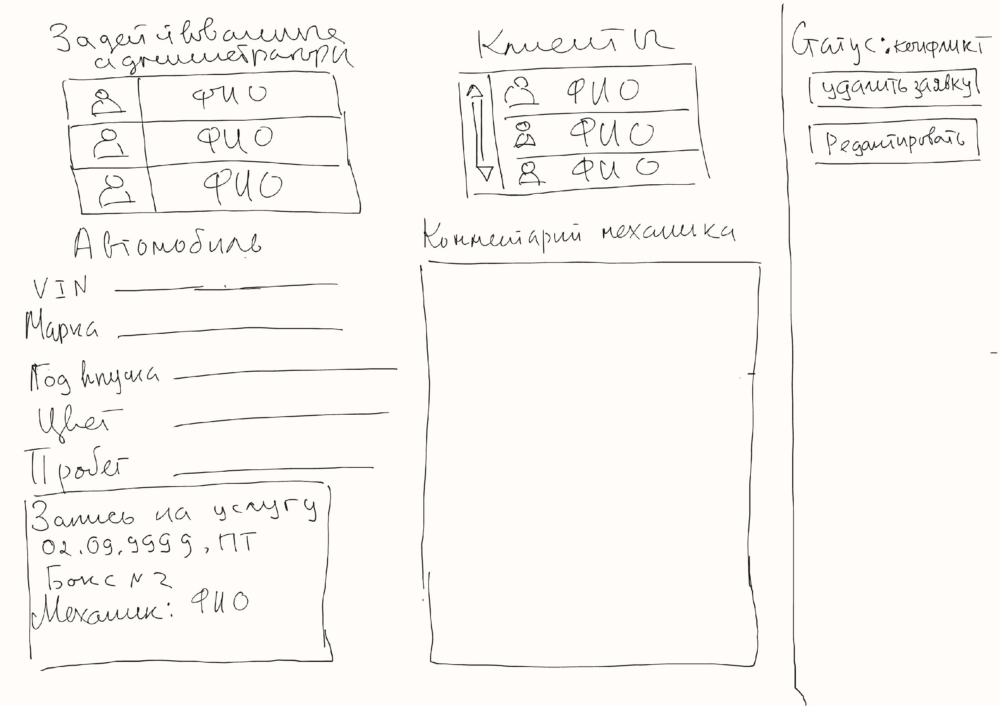

Пример договора хранения чего-то

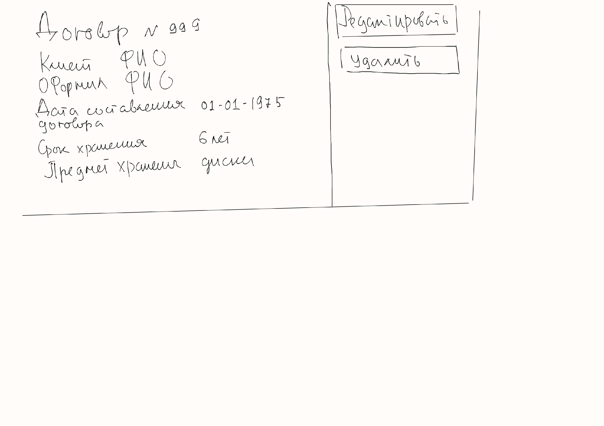

## Формализация ключевых бизнес-процессов

1. BPMN-диаграмма процесса редактирования расписания механика.

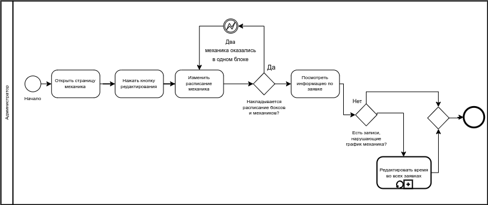

2. BPMN-диаграмма процесса редактирования графика работы механика.

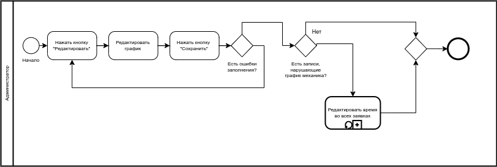

3. BPMN-диаграмма жизненного цикла заявки на услугу

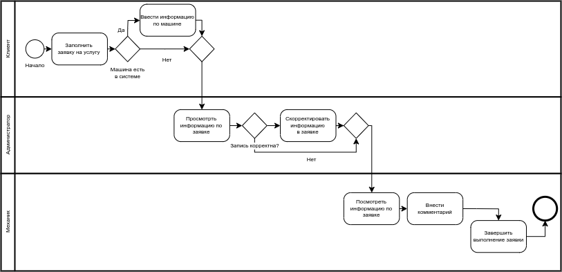

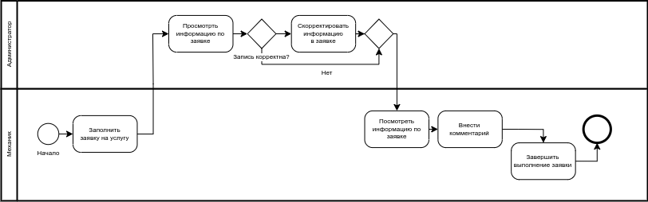

## Тип приложения 

SPA-приложение

## Выбранный технологический стек

<ol>
    <li>язык программирования TypeScript;</li>
    <li>фреймворк Next.js;</li>
    <li>ORM Prisma;</li>
    <li>СУБД Postgre.</li>
</ol>

## Верхнеуровневое разбиение на компомпоненты 

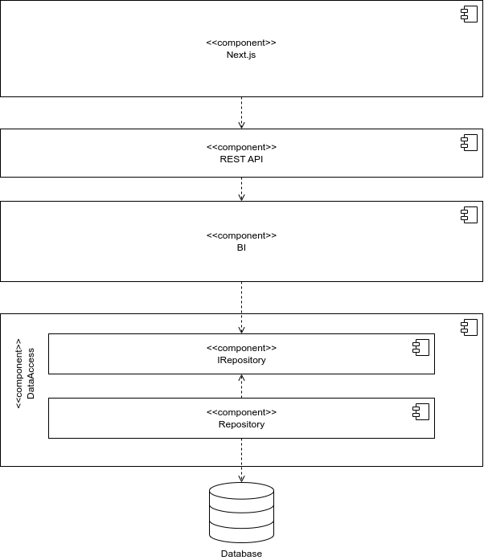

## UML диаграммы классов

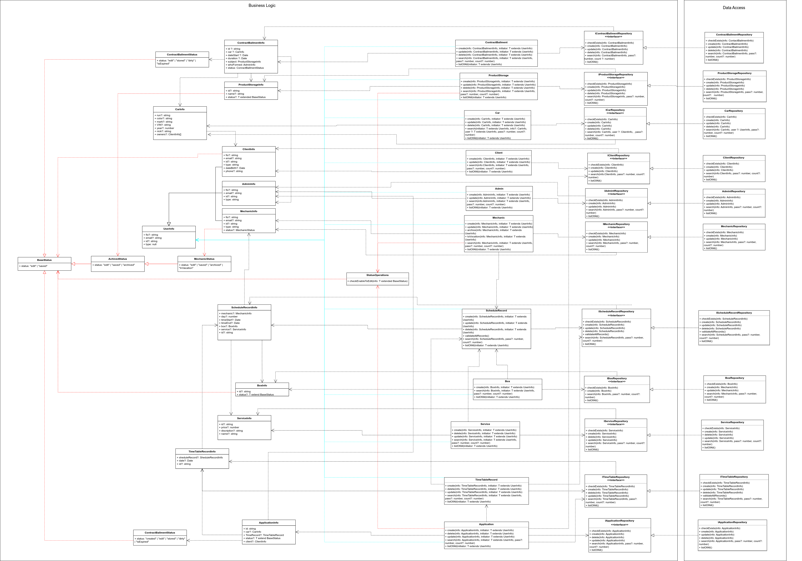

